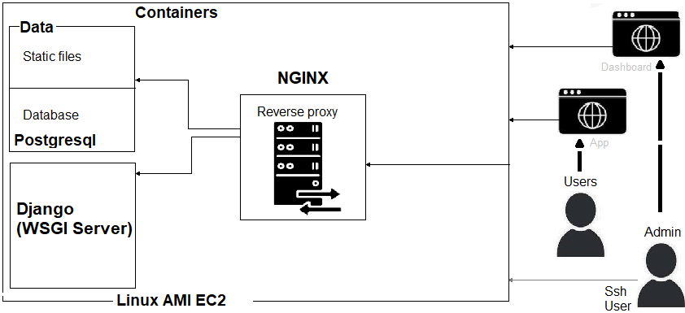

# swap-backend

## Overview

This is a web app to transfer money amoung people. People could have several payments methods, such as Apple Pay or PayPal. People can sell or borrow money and buying or lend money to other people. That's the main goal of the project.

- Note: This project is under construction, but some services are working already. Login, logout, register, seen my account and so on.

## Links

- Website app (it is meant for mobile): click here http://app-trade.s3-website.us-east-2.amazonaws.com/
- Website dashboard (personal computer): http://app-trade.s3-website.us-east-2.amazonaws.com/dashboard/login
- API docs: http://ec2-18-224-27-176.us-east-2.compute.amazonaws.com/api/v1/docs/

## Technologies

- Python and Javascript, and Bash.
- Reactjs framework for the website.
- Django framework as backend.
- Postgresql as a database.
- Amazon Linux EC2 for deploying the backend (API).
- Amazon S3 for deploying the website (frontend).
- Docker containers for running the different services inside the EC2 instance.
- Docker compose to orchestrate all services (Django, database, proxy, etc).
- Amazon S3 Bucket for deploy the static website.

## Architecture

The rendering of the project is simple. Three containers managing three different services:

1. Django, django-rest-framework and uswgi server that handles bussiness logic for the database, like create users, register user and so on.
2. Postgresql is the database chosen.
3. NGINX acts as a reverse proxy for rendering static files and more to and fro the users and the services.
4. PGadmin is a service (not deployed in production) to check out Postgresql databases.

As a simple explanation, users open the app in their phones, register or login, add payment methods and in the near future transfer money to other peers, see transactions, open disputes when there is a problem, upload personal documents for disputes etc, Also a complete dashboard is develop to manage the whole system.